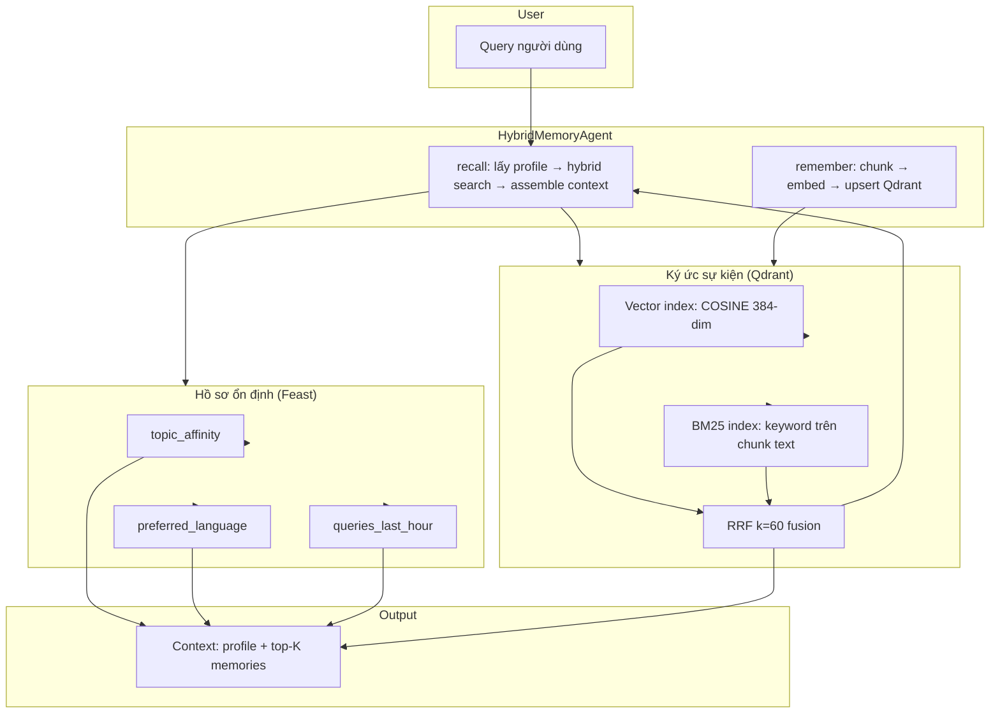

# Bonus Challenge: Hybrid Memory Agent

## 1. Đề bài

Xây dựng trợ lý AI cá nhân cho người dùng tiếng Việt (think: ChatGPT + NotebookLM
cho cá nhân). Trợ lý phải **nhớ** hai loại thông tin:

1. **Ký ức sự kiện (episodic memory)** — các cuộc hội thoại, tài liệu đã đọc,
   ghi chú người dùng. → Vector Store (lab 19 §1–§3).
2. **Hồ sơ ổn định (stable profile)** — ngôn ngữ ưa thích, tốc độ đọc, lĩnh
   vực quan tâm, hoạt động gần đây. → Feature Store (lab 19 §4).
3. **Hoạt động gần đây** — câu truy vấn 1 giờ qua, topic đã hỏi nhiều, pattern
   mệt mỏi. → Streaming feature (lab 19 §6).

Nhiệm vụ: thiết kế + build POC kết hợp cả hai. Document is the primary deliverable;
code chỉ cần minimal để demo design quyết định.

## 2. Sơ đồ kiến trúc

**Data flow:**

1. `remember(text, user_id)`: chia text thành chunk ≤ 200 token theo turn, embed
   bằng `bge-small-en-v1.5`, upsert vào Qdrant collection với payload `user_id`.
2. `recall(query, user_id)`: truy xuất user profile từ Feast online store.
3. Truy vấn cùng query — embed → vector ANN search (filtered by user_id) +
   BM25 keyword search.
4. RRF (k=60) hợp nhất kết quả, trả về top-K memory chunks.
5. Gộp profile + memories thành context string cho LLM.

## 3. Ba quyết định kiến trúc (với tradeoff tường minh)

### Quyết định 1: Chiến lược chia chunk — Semantic Turn Split

**Chọn:** Chia theo dấu hiệu `User:` / `Assistant:`, tối đa 200 token mỗi chunk.
Nếu một turn vượ quá 200 token, fallback chia theo câu.

| Phương pháp                | Chất lượng truy xuất                       | Chi phí lưu trữ               | Hiệu quả context                       |
| -------------------------- | ------------------------------------------ | ----------------------------- | -------------------------------------- |
| Semantic turn split (chọn) | Cao — mỗi chunk là một suy nghĩ hoàn chỉnh | Trung bình — 1-3 chunk/memory | Tốt — chunk tự chứa đủ ngữ cảnh        |
| Sliding window 128 token   | Thấp — cắt giữa câu, mất nghĩa             | Cao — 5-10x nhiều chunk       | Kém — nhiều chunk rời rạc không signal |
| Mỗi câu một chunk          | Trung bình-thấp — quá tơi xỉ               | Rất cao — 10x điểm            | Kém — signal bị phân tán               |

**Lý do chọn semantic turn:** LLM cần đủ ngữ cảnh để hiểu một chunk. Một sliding
window cắt "Kubernetes HPA tự động scale dựa trên..." giữa chừng sẽ cho RRF
điểm thấp. Turn-level chunk giữ nguyên cặp hỏi-đáp — đó là signal quan trọng
nhất cho retrieval chất lượng.

### Quyết định 2: Lược đồ feature — Tabular Features Only

**Chọn:** Chỉ dùng tabular features từ Feast — `topic_affinity`,
`preferred_language`, `queries_last_hour`, `distinct_topics_24h`.

| Phương pháp        | Độ trễ                        | Độ phức tạp                          | Giá trị truy xuất                         |
| ------------------ | ----------------------------- | ------------------------------------ | ----------------------------------------- |
| Tabular (chọn)     | <10ms (SQLite)                | Đơn giản — truy cập trường trực tiếp | Cao — định tuyến query, chuyển ngôn ngữ   |
| Embedding features | 50-100ms (thêm vector search) | Cao — thêm Qdrant collection         | Thấp — `topic_affinity` đã bao phủ intent |

**Lý do chọn tabular:** Các feature profile phục vụ chiến lược truy xuất (chuyển
topic, chuyển ngôn ngữ), không phải tìm kiếm similarity. Lưu thêm một vector
embedding cho user profile chỉ tăng độ trễ mà không cải thiện recall — vector
search episodic memory đã xử lý similarity. Sức mạnh của Feature Store là
**key-value lookup**, không phải vector storage.

### Quyết định 3: Chiến lược làm mới — Immediate Upsert

**Chọn:** `remember()` ghi ngay vào Qdrant. Profile đọc từ Feast online store.

| Phương pháp             | Đảm bảo nhất quán                    | Độ trễ     | Throughput                              |
| ----------------------- | ------------------------------------ | ---------- | --------------------------------------- |
| Immediate upsert (chọn) | Mạnh — truy vấn thấy memory mới ngay | ~5ms/write | Thấp — không phù hợp stream write nhiều |
| Batch refresh 5 phút    | Eventual — bỏ qua 5 phút             | ~0ms       | Cao                                     |
| Daily batch             | Trễ — bỏ qua hoạt động gần đây       | ~0ms       | Rất cao                                 |

**Áp dụng theo use case:**

| Use case                    | Chiến lược             | Lý do                          |
| --------------------------- | ---------------------- | ------------------------------ |
| "Tôi vừa đọx xong, hãy nhớ" | **Immediate**          | User mong nhận được xác nhận   |
| "Recommend đọc gì tiếp"     | **Immediate**          | Dùng `topic_affinity` mới nhất |
| Analytics dashboard         | **Daily**              | Không cần real-time            |
| Phát hiện gian lận          | **Streaming** (5 phút) | Ngoài scope POC này            |

## 4. Lựa chọn đã loại bỏ

**Xét nghĩa: Lưu trữ episodic memory trong Feast như embedding feature view.**

Điều này giúp Feast quản lý cả profile và vector episodic qua hạ tầng thống nhất.

**Loại bỏ vì:** Episodic memory có access pattern và update cadence hoàn toàn
khác với stable profile:

- **Profile:** append-only, TTL dài (30 ngày), batch materialize OK.
- **Episodic:** append mỗi cuộc hội thoại, cửa sổ thời gian ngắn, tần suất ghi
  cao, không cần PIT join.

Nếu trộn cả hai trong một FeatureView, toàn bộ collection sẽ phải dùng TTL
ngắn hơn — evict profile ổn định trước thời hạn. Hai hệ thống còn có serving
pattern không tương thích: Feast tối ưu cho key-value lookup, Qdrant tối ưu
cho k-NN / RRF. Tách biệt giúp mỗi hệ tối ưu cho workload của nó.

## 5. Cân nhắc ngữ cảnh tiếng Việt

1. **Tokenizer cho BM25:** Dùng whitespace tokenize kế thừa từ
   `app/search.py`. Đủ dùng cho text Việt-Anh hỗn hợp nhưng bỏ sót subword.
   Production nên dùng `underthesea` hoặc `pyvi`.

2. **Code-switching (Vi/En):** Bản đồ `TOPIC_HINTS` trong `app/agent.py` đã xử lý —
   ví dụ `"cloud"` match cả `"đám mây"` và `"cloud"`. Agent kế thừa pattern này.

3. **Giới hạn embedding model:** `bge-small-en-v1.5` training trên tiếng Anh.
   Vietnamese paraphrases chỉ 24-32% recall (NB2). Agent dùng **cả** BM25 +
   vector với RRF — keyword bắt được verbatim mà vector bỏ sót. Đổi sang `bge-m3`
   (qua `EMBEDDING_BACKEND=bge-m3`) sẽ cải thiện đáng kể.

4. **Timestamp:** Dùng Unix timestamp. Không vấn đề timezone vì single process.
   Đối với session đa ngày, lưu dưới dạng UTC có timezone.

## 6. Giới hạn của POC

- **Phân cách tenant:** In-memory Qdrant không enforce isolation. Production cần
  `user_id` filter + encryption + access control middleware.
- **Memory decay:** Không có TTL evict cũ. Cần prune memory cũ hơn N ngày.
- **Đồng bộ đa thiết bị:** Hai device chạy agent riêng biệt sẽ có memory store
  khác nhau. Cần backend chung (Qdrant server, không phải in-memory).
- **Không tích hợp LLM:** `recall()` trả về context string — không gọi LLM sinh
  câu trả lời. POC dừng ở bước assembly.
- **Không CRUD memory:** Chỉ `remember` (append). Không có delete/update/forget.
